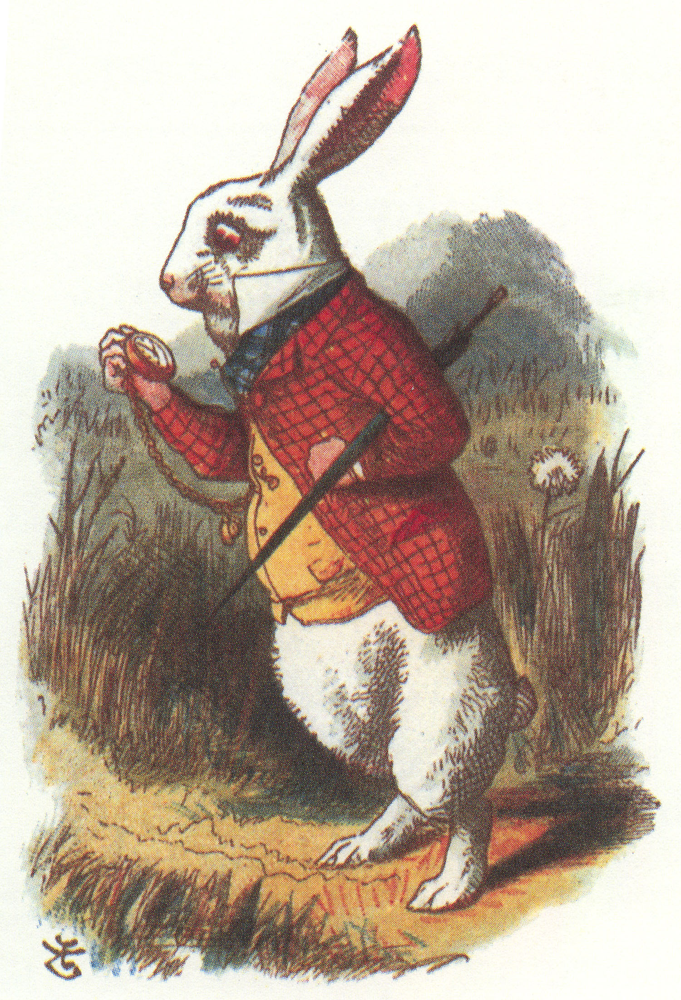

# Introduction
My second year began with a bang! Here is the picture of me doing some funky stuff:

<!--more-->




```{r setup, include=FALSE}
library(tidyverse)
library(tidygraph)
library(ggraph)
library(igraph)
library(igraphdata)
```

```{r}
data(karate)
karate

karate %>% ggraph(., layout = "graphopt") + 
  geom_edge_link0(aes(width = weight)) +
  geom_node_point(aes(color = color), size = 6)

```

